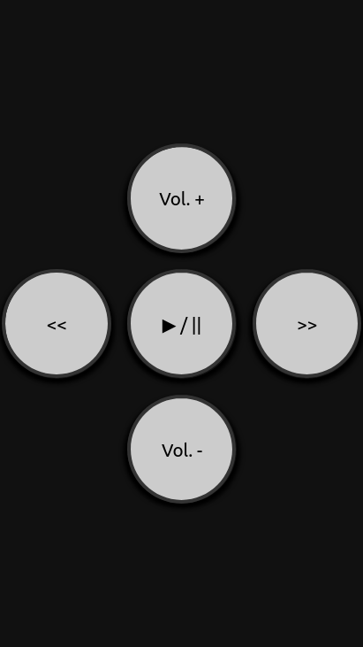

# Movie Night Remote Control

Remotely control a video using a browser or smartphone.

The web server runs on the same computer as the video. On port 8080, it receives virtual keyboard input via HTTP requests with the parameter ?KEY=NAME.
The key corresponding to the key is pressed via evemu-event on the computer.
A static web page contains the buttons to be pressed. The web page can now be used to remotely control the video. On the smartphone you can place the web page on the home screen, it will then behave like an app.

- Start: sudo movie-night-rc
- Start a video in a player of your choice
- You can now access the remote control from any device in the same network on port 8080 of the computer

Attention! evemu-event will only run with root privileges. This allows to send unsecured keyboard input over the network to any foreground application!

